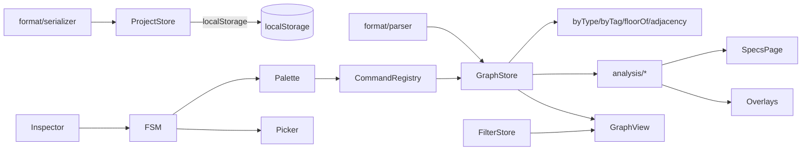

# TNI PWA - Phased Implementation Plan

Phased build of the Tower Networking Inc PWA per [docs/specs/](docs/specs/). Stack: **Vite + Vue 3 (`<script setup lang="ts">`) + TypeScript strict + Pinia + plain CSS with `--tni-*` custom properties**. Pause for review after each phase.

## Stack & Conventions

- Vite + Vue 3 + TypeScript strict + Pinia + `vite-plugin-pwa`.
- Styling: plain CSS with `--tni-*` custom properties at `:root` (light/dark), matching [docs/specs/visualization.md](docs/specs/visualization.md) Theming.
- d3 pieces: `d3-force`, `d3-selection`, `d3-zoom`, `d3-drag`, `d3-quadtree`.
- Test: Vitest + @vue/test-utils; parser/analyzer are pure-TS and unit-tested.
- Lint: ESLint + Prettier.

## Folder layout

```
src/
  main.ts, App.vue
  model/        (graphdata) types, indices, validation
  format/       (fileformat v1) parser + serializer + canonicalizer
  store/        Pinia: projectStore, graphStore, fsmStore, filterStore, historyStore
  fsm/          app state machine (statemachine)
  commands/     registry + each command
  palette/      CommandPalette.vue + completers
  view/         GraphView.vue (SVG today, canvas later), overlays, tooltip
  filters/      FilterPanel.vue + URL hash sync
  inspector/    NodeInspector.vue, EntityEditor.vue, ConfirmDialog.vue
  analysis/     supply/demand, shortest-path, bottlenecks, resources
  specs/        SpecsPage.vue (tables)
  inspect/      pick mode, route & bottleneck tools, result panel, path highlight
  styles/       variables.css, base.css, tokens.css
  assets/
tests/
```

## Architecture



## Phase Checklist

- [ ] **Phase 0** - Scaffold
- [ ] **Phase 1** - Graph data model
- [ ] **Phase 2** - File format v1 parser + serializer
- [ ] **Phase 3** - Project store & persistence
- [ ] **Phase 4** - App state machine
- [ ] **Phase 5** - Command palette + registry
- [ ] **Phase 6** - Graph visualization (SVG)
- [ ] **Phase 7** - Filters
- [ ] **Phase 8** - Inspector + entity editor
- [ ] **Phase 9** - Behaviors, Usage Types, bandwidth analyzer
- [ ] **Phase 10** - Programs & server resources
- [ ] **Phase 11** - Specs page
- [ ] **Phase 12** - Inspection tools
- [ ] **Phase 13** - Overlays
- [ ] **Phase 14** - Undo/redo, polish, PWA

---

## Phase 0 - Scaffold

- `npm init vite@latest` Vue+TS; add Pinia, `vite-plugin-pwa`, d3 deps, vitest, eslint, prettier.
- Create folder layout above, stub `App.vue` with `--tni-*` base palette + light/dark.
- Replace README stub; `package.json` scripts: `dev`, `build`, `preview`, `test`, `lint`.

**Exit criteria**: `npm run dev` serves blank themed shell; `npm test` runs zero tests green.

## Phase 1 - Graph data model

Spec: [docs/specs/graphdata.md](docs/specs/graphdata.md)

- `model/types.ts` for every NodeType, Tag, RelationName listed in Canonical tag list and Relationships table.
- `model/validation.ts` implements every rule in Validation rules (dangling edges, media match, uniqueness, numeric fields non-negative, pool-name match with program).
- `model/indices.ts` builds `byType`, `byTag`, `floorOf`, `adjacency`; exposes incremental add/remove ops.
- No UI yet.

**Exit criteria**: unit tests green for every validation rule; indices rebuild and incrementally update correctly.

## Phase 2 - File format v1

Spec: [docs/specs/fileformat.md](docs/specs/fileformat.md)

- `format/lexer.ts`, `format/parser.ts` per EBNF; accept entities before or after edges, require `!tni v1` header.
- `format/serializer.ts` emits canonical form: type order, edge-relation order, lexicographic within group, tag+prop sort.
- Error reporting with line/col + "did you mean" for relation names.

**Exit criteria**:
- `parse(serialize(model)) === model`
- `serialize(parse(canonical)) === canonical` byte-for-byte
- Example (full) fixture from the spec round-trips.

## Phase 3 - Project store & persistence

Specs: [docs/specs/fileformat.md](docs/specs/fileformat.md) Browser storage, [docs/specs/commands.md](docs/specs/commands.md) Project

- `store/projectStore.ts`: slug list under `tni.projects`, per-project text under `tni.project.<slug>`.
- Quota guard (>4 MB warn), `QuotaExceededError` handling.
- Commands stub: `new`, `load`, `save`, `list projects`, `rm project`, `export`, `import`.

**Exit criteria**: can new/save/load/export/import a project via console API; quota warning fires.

## Phase 4 - App state machine

Spec: [docs/specs/statemachine.md](docs/specs/statemachine.md)

- `store/fsmStore.ts` discriminated union `AppState` exactly as spec.
- Event dispatchers (`backtick`, `escape`, `clickNode`, `edit`, `delete`, `confirm`, I/O lifecycle, `startPick`, `pickFirst/Second`).
- Global keydown handler with focus-trap rules (swallow `` ` `` inside inputs).

**Exit criteria**: Vitest state-transition tests cover every edge in the mermaid diagram.

## Phase 5 - Command palette + registry

Specs: [docs/specs/commandline.md](docs/specs/commandline.md), [docs/specs/commands.md](docs/specs/commands.md)

- `commands/registry.ts` with `CommandDef`, `ArgSpec`, `Completer` types verbatim.
- Tokenizer (quoted-string aware), validator, ghost-text, Tab cycling, history (`tni.cmdhistory`, cap 200), Ctrl+R reverse search.
- `CommandPalette.vue`: three-row layout (input, completions, status), monospace, `--tni-accent` prompt.
- Register Phase-1/2/3 commands: `add node`, `rm node`, `mod node`, `rename node`, `add edge`, `rm edge`, `mod edge`, `link`, `unlink`, `tag add/rm/list`, `save`, `load`, `new`, `export`, `import`, `help`, `echo`.

**Exit criteria**: backtick opens palette, Tab completes against graph ids, Enter executes, history persists.

## Phase 6 - Graph visualization (SVG)

Spec: [docs/specs/visualization.md](docs/specs/visualization.md)

- `view/GraphView.vue` SVG renderer; d3 force config with distances/strengths from `edge.strength`, `alphaDecay=0.05`, `visibilitychange` pause.
- Node shapes per type; edge color/dash/arrowhead per relation name; labels.
- Pan/zoom `[0.1, 8]`, double-click fit, keyboard pan/`+/-/f/g`.
- Hover tooltip (HTML div, viewport-clamped); shift-click multi-select.
- Floor layout toggle (`forceY` per floor). Canvas fallback scaffolded but disabled until >2000 nodes.

**Exit criteria**: loading the full example renders a readable, pannable, zoomable graph with labels and tooltips.

## Phase 7 - Filters

Spec: [docs/specs/filters.md](docs/specs/filters.md)

- `store/filterStore.ts` with `FilterState` shape exactly as spec; `passes()` predicate; memoized Sets for nodes/edges.
- `FilterPanel.vue` with counts per group, "Clear all", preset save/load (`tni.filter.presets`).
- `filter ...` commands registered.
- URL hash sync (`#floors=1,2&tags=...`) on change, parsed on load.

**Exit criteria**: filters hide nodes/edges live; URL roundtrips; presets persist.

## Phase 8 - Inspector + entity editor

- `NodeInspector.vue` bound to `NodeInspectorOpen` with edit/delete buttons.
- `EntityEditor.vue` bound to `EditingEntity`; form fields derived from each node type's schema (reused from model).
- `ConfirmDialog.vue` for `ConfirmDestructive`.
- `rm node`/`rm edge` wired through confirm unless `--force`.

**Exit criteria**: click node opens inspector; Edit loads typed form; Delete confirms and cascades edges.

## Phase 9 - Behaviors, Usage Types, bandwidth analyzer

Spec: [docs/specs/behaviors.md](docs/specs/behaviors.md)

- Add node types `consumerbehavior`, `producerbehavior`, `behaviorinsight`, `usagetype` + edges `Insight`, `Consumes`, `Provides` (model + parser + serializer + validation + UI renderers).
- Commands: `add behavior`, `add insight`, `add usage`, `link insight`, `link consume`, `link provide`, `unlink consume|provide`, `mod insight`, `mod device --traversals`.
- `analysis/demand.ts`, `analysis/supply.ts`, `analysis/path.ts` (BFS from Route finding), `analysis/bottleneck.ts` matching Bottleneck analysis algorithm with ECMP flag.
- `analysis/cache.ts` keyed on graph hash, invalidated on mutation.
- `analyze`, `usage`, `reachable`, `bottleneck` commands.

**Exit criteria**: golden-file fixtures per usage type pass; bottleneck command lists saturated devices.

## Phase 10 - Programs & server resources

Spec: [docs/specs/programs.md](docs/specs/programs.md)

- Extend `server` node with `cpuTotal`, `memoryTotal`, `storageTotal`; add `program` node type + `Install` edge + `amount` / `pool` on `Consumes`/`Provides`.
- Pool splitter: equal-split subject to `amount` minima (honors Amount and pool semantics).
- Canonical starter-program catalog (Canonical starter programs table) auto-populated on `program install <slug>` when missing.
- `analysis/resources.ts` returns `overCpu/overMemory/overStorage`.
- Commands: `program install/uninstall/list/show`, `add program`, `mod program`, `rm program`, `mod server --cpuTotal/--memoryTotal/--storageTotal`.

**Exit criteria**: pool math unit tests pass for GitCoffee (16/2), Padu_V1 (1/2), Mailer (two pools); overcommit flags fire.

## Phase 11 - Specs page

Specs: [docs/specs/behaviors.md](docs/specs/behaviors.md) Specs page + [docs/specs/programs.md](docs/specs/programs.md) Specs page additions

- `specs/SpecsPage.vue` sections: Totals, By Usage Type, By Customer, By Producer/Domain, Device utilization, Programs, Server capacity, Bottlenecks.
- Each row deep-links into the graph with a filter preset applied.
- `specs` command opens page without recompute; `analyze` forces recompute then opens.

**Exit criteria**: all 8 sections render with live data; row clicks navigate back with filter applied.

## Phase 12 - Inspection tools

Spec: [docs/specs/inspect.md](docs/specs/inspect.md)

- `inspect/pick.ts` drives `PickingTarget` banner + crosshair + endpoint-badges; re-routes `clickNode`.
- `inspect/route.ts` and `inspect/bottleneck.ts` per Algorithms, including link-capacity check.
- `inspect/resolveEndpoint.ts` walks `Owner`/`NIC` to physical port; prompts on ambiguous domain hosts.
- `InspectionResultPanel.vue` (pinned right-side) with Close/Copy/`Bottleneck this path`.
- `ui.pathHighlight` store + CSS classes `.path-node`, `.path-edge`, `.path-primary-bottleneck`.
- Commands + aliases `route`, `btwn`; shortcuts `r`, `Shift+b`, `Esc`.

**Exit criteria**: pick mode works via keyboard and mouse; route + bottleneck render path + primary bottleneck styling.

## Phase 13 - Overlays

- Bottleneck overlay (`b`): green/yellow/orange/red fill on devices by `load/traversalsPerTick`; unreachable dashed overlay.
- Server resource overlay (`r`): 3-segment CPU/Mem/Storage micro-bar under each server; red halo on any overcommit.
- Overlays compose with path highlight per Inspection path highlight composition rule.

**Exit criteria**: both overlays toggle independently; compose cleanly with inspection path highlight.

## Phase 14 - Undo/redo, polish, PWA

- `store/historyStore.ts` per Undo / redo model (cap 200, cascade collapse, optional persistence).
- `undo`/`redo`/`history`/`clear history`/`alias`/`rm alias`/`theme`/`layout`/`focus`/`select`/`clear selection` commands.
- Accessibility: `role="img"`+`aria-label` per node; tabbable ordered list; `prefers-reduced-motion`.
- `vite-plugin-pwa` manifest + offline cache; app icon.
- Canvas fallback enabled for >2000 nodes per Rendering approach.
- Final pass: error-message polish, "did you mean" hints, `help <cmd>`.

**Exit criteria**: full PWA installable + offline; undo/redo reliable across all mutating commands; a11y audit clean.

---

## Key risks & mitigations

- **Parser round-trip**: gate Phase 2 on byte-equal canonical output for the full example in [docs/specs/fileformat.md](docs/specs/fileformat.md).
- **Analyzer correctness**: golden-file fixtures per usage type so regressions surface before UI glue.
- **FSM sprawl**: keep transitions in one module with an exhaustiveness-checked switch so adding a state is a compile error elsewhere.
- **Pool-split math**: unit test GitCoffee (16 over 2), Padu_V1 (1 over 2), Mailer (two pools, one consume + one provide).

## Done definition

Full PWA: load/save/export/import `.tni` files, create/modify graphs by palette or inspector, filter and layout the view, run supply/demand analysis + per-server resource accounting, inspect routes and bottlenecks interactively, undo/redo, theme, offline-capable install.
