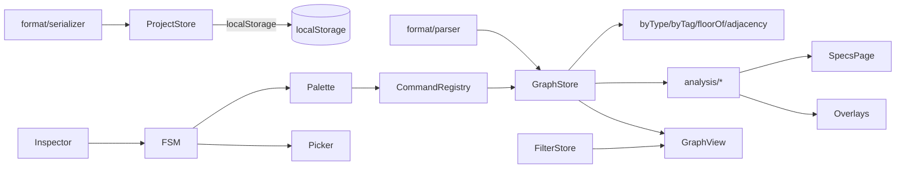

# TNI PWA - Phased Implementation Plan

Phased build of the Tower Networking Inc PWA per [docs/specs/](docs/specs/). Stack: **Vite + Vue 3 (`<script setup lang="ts">`) + TypeScript strict + Pinia + plain CSS with `--tni-*` custom properties**. Pause for review after each phase.

## Stack & Conventions

- Vite + Vue 3 + TypeScript strict + Pinia + `vite-plugin-pwa`.
- Styling: plain CSS with `--tni-*` custom properties at `:root` (light/dark), matching [docs/specs/visualization.md](docs/specs/visualization.md) Theming.
- d3 pieces: `d3-force`, `d3-selection`, `d3-zoom`, `d3-quadtree` (`d3-drag` only as a dependency of `d3-zoom`). Node dragging in `GraphView` uses pointer events + `d3.pointer`, not `d3.drag`.
- Test: Vitest + @vue/test-utils; parser/analyzer are pure-TS and unit-tested.
- Lint: ESLint + Prettier.

## Folder layout

```
src/
  main.ts, App.vue
  model/        (graphdata) types, indices, validation
  format/       (fileformat v1) parser + serializer + canonicalizer
  store/        Pinia: projectStore, graphStore, fsmStore, filterStore, historyStore
  fsm/          app state machine (statemachine)
  commands/     registry + each command
  palette/      CommandPalette.vue + completers
  view/         GraphView.vue (SVG today, canvas later), overlays, tooltip
  filters/      FilterPanel.vue + URL hash sync
  inspector/    NodeInspector.vue, EntityEditor.vue, ConfirmDialog.vue
  analysis/     supply/demand, shortest-path, bottlenecks, resources
  specs/        SpecsPage.vue (tables)
  inspect/      pick mode, route & bottleneck tools, result panel, path highlight
  styles/       variables.css, base.css, tokens.css
  assets/
tests/
```

## Architecture



## Phase Checklist

- [x] **Phase 0** - Scaffold
- [x] **Phase 1** - Graph data model
- [x] **Phase 2** - File format v1 parser + serializer
- [x] **Phase 3** - Project store & persistence
- [x] **Phase 4** - App state machine
- [x] **Phase 5** - Command palette + registry
- [ ] **Phase 6** - Graph visualization (SVG)
- [ ] **Phase 7** - Filters
- [ ] **Phase 8** - Inspector + entity editor
- [ ] **Phase 9** - Behaviors, Usage Types, bandwidth analyzer
- [ ] **Phase 10** - Programs & server resources
- [ ] **Phase 11** - Specs page
- [ ] **Phase 12** - Inspection tools
- [ ] **Phase 13** - Overlays
- [ ] **Phase 14** - Undo/redo, polish, PWA

---

## Phase 0 - Scaffold

- `npm init vite@latest` Vue+TS; add Pinia, `vite-plugin-pwa`, d3 deps, vitest, eslint, prettier.
- Create folder layout above, stub `App.vue` with `--tni-*` base palette + light/dark.
- Replace README stub; `package.json` scripts: `dev`, `build`, `preview`, `test`, `lint`.

**Exit criteria**: `npm run dev` serves blank themed shell; `npm test` runs zero tests green.

## Phase 1 - Graph data model

Spec: [docs/specs/graphdata.md](docs/specs/graphdata.md)

- `model/types.ts` for every NodeType, Tag, RelationName listed in Canonical tag list and Relationships table.
- `model/validation.ts` implements every rule in Validation rules (dangling edges, media match, uniqueness, numeric fields non-negative, pool-name match with program).
- `model/indices.ts` builds `byType`, `byTag`, `floorOf`, `adjacency`; exposes incremental add/remove ops.
- No UI yet.

**Exit criteria**: unit tests green for every validation rule; indices rebuild and incrementally update correctly.

## Phase 2 - File format v1 — **done**

Spec: [docs/specs/fileformat.md](docs/specs/fileformat.md)

- `src/format/parser.ts` — line-oriented scanner + entity/edge parser; handles `!tni v1` header, comments, `\`-continuation, dotted property keys, quoted strings with `\"`/`\\`/`\n` escapes, bare and quoted domain ids, relation inference for unambiguous type pairs.
- `src/format/serializer.ts` — canonical output with fixed `ENTITY_TYPE_ORDER` + `RELATION_ORDER`, lex sort within groups, tags-before-props, default-tag/default-property elision, undirected-endpoint lex canonicalization.
- `src/format/errors.ts` — `ParseError` with `line`, `col`, Levenshtein-based "did you mean" suggestions for unknown node types and relation names.
- Relaxation vs. EBNF line 104 documented in parser: `Ident` continuation chars accept `[a-zA-Z0-9_-]` so the spec's own camelCase examples (`deviceAddress`, `traversalsPerTick`) tokenize.
- `src/App.vue` round-trips the Phase 1 demo graph and renders the canonical text in a collapsible `<details>` block plus an "OK / FAIL" badge.

**Exit criteria met**:
- `parse(serialize(model))` structurally equal to `model` (covered in `tests/format/roundtrip.test.ts`).
- `serialize(parse(canonical))` byte-for-byte idempotent after one canonicalization pass.
- Example fixture modelled on `docs/specs/fileformat.md` round-trips.
- `npm test` (79 tests), `npm run lint`, `npm run build` all green.

## Phase 3 - Project store & persistence — **done**

Specs: [docs/specs/fileformat.md](docs/specs/fileformat.md) Browser storage, [docs/specs/commands.md](docs/specs/commands.md) Project

- `src/store/storage.ts` — `localStorage` adapter with `StorageLike` interface, `MemoryStorage` in-memory fallback for tests/SSR, `byteSize` (UTF-8 aware), quota guard at `QUOTA_WARN_BYTES = 4 MB`, `QuotaExceededError` → `StorageError{ code: 'quota-exceeded' }`, slug regex `[a-z0-9][a-z0-9_-]*`.
- `src/store/graphStore.ts` — Pinia store wrapping the `Graph` as a `shallowRef`; exposes reactive `stats` + `report` plus `parseText`/`serializeText` passthroughs.
- `src/store/projectStore.ts` — `new`, `load`, `save`, `removeProject`, `list`, `exportCurrent`, `importText`, `hydrate`; maintains `slugs[]`, `active`, `dirty`, and persists the index under `tni.projects`. Export/import keep DOM side-effects out of the store so it stays unit-testable.
- `src/App.vue` — wired the smoke UI to the store: slug input, new/save/load/rm/export buttons, seed-demo helper, paste-to-import, canonical-text preview, live stats + quota warning.

**Exit criteria met**:
- `npm test` (103 tests) covers slug validation, quota warnings, `QuotaExceededError` translation, full CRUD through the Pinia store, and hydration recovery from a corrupt index.
- Can `new / save / load / export / rm` a project from the UI; reload restores via `hydrate`.
- `npm run lint` + `npm run build` green.

## Phase 4 - App state machine — **done**

Spec: [docs/specs/statemachine.md](docs/specs/statemachine.md)

- `src/fsm/types.ts` — `AppState` discriminated union with all 10 top-level kinds plus `PaletteSub` for the nested palette substates; `Event` union mirrors the spec's event list (`backtick`, `escape`, `clickNode`, `clickBackground`, `toggleFilters`, `edit`, `delete`, `confirm`/`cancel`, `inputChanged`, `tab`/`shiftTab`, `enter`, `commandOk`/`commandErr`, `loadStart`/`loadDone`, `saveStart`/`saveDone`, `startPick`, `pickFirst`/`pickSecond`, `inspectDone`/`inspectCancel`).
- `src/fsm/transitions.ts` — pure `transition(state, event)` reducer with per-kind sub-reducers; returns the same reference on no-ops so callers can detect "nothing happened". Encodes rules: escape peels one nesting level, `ExecutingCommand` is non-cancellable, `--force` bypasses `ConfirmDestructive`, `clickBackground` suppressed in `PickingTarget`, first `clickNode` during picking is routed to `pickFirst`.
- `src/fsm/keyboard.ts` — `bindGlobalKeys(dispatch, { isPaletteOpen, isTextFocus })` returns an unbind fn; backtick is swallowed inside `<input>`/`<textarea>`/contenteditable, Tab/Enter only fire while the palette is open, escape always fires.
- `src/store/fsmStore.ts` — Pinia wrapper holding the state as a `shallowRef`; exposes `dispatch`, `reset`, plus `kind`/`isPaletteOpen`/`isModal`/`isBusy`/`isPicking` computed getters.
- `src/App.vue` — wires `bindGlobalKeys` in `onMounted`/`onBeforeUnmount`, surfaces `fsmLabel` in the topbar, dispatches `loadStart/Done` + `saveStart/Done` around the project IO buttons.
- Documented deviation: `ConfirmDestructive.returnTo` stores the full prior `AppState` (not just the kind) so cancelling a delete restores an inspector selection or editing draft without data loss.

**Exit criteria met**:
- `tests/fsm/transitions.test.ts` (47 tests) covers every labeled edge in the diagram plus the cross-cutting rules.
- `tests/fsm/keyboard.test.ts` (6 tests) covers backtick focus-trap, escape always-firing, palette-gated Tab/Enter, unbind.
- `npm test` 156/156, `npm run lint`, `npm run build` all green.

## Phase 5 - Command palette + registry (done)

Specs: [docs/specs/commandline.md](docs/specs/commandline.md), [docs/specs/commands.md](docs/specs/commands.md)

Delivered:
- `src/commands/`: `types.ts` (`CommandDef`, `ArgSpec`, `FlagSpec`, `ParsedArgs`, `CommandContext`), `registry.ts` (multi-word name resolution + aliases), `tokenizer.ts` (quote-aware with char ranges and caret locator), `parser.ts` (positional + spaced/inline/repeatable flags, number/floor coercion), `completer.ts` (per-arg-type candidate lookup over `Graph`), `history.ts` (persisted at `tni.cmdhistory`, cap 200, dedupe-consecutive, Up/Down cursor), `executor.ts` (tokenize -> resolve -> parse -> run), `builtins.ts` (add node, rm node, tag add, tag list, echo, help, save, load, new, list projects, rm project, clear history).
- `src/palette/CommandPalette.vue`: overlay driven by FSM state, `>` prompt, monospace input, completions popup (Tab / Shift+Tab cycle), status line, history walk.
- Wired into `App.vue`; `graphStore.touch()` added for in-place mutation commands.
- 47 new tests (tokenizer, registry, parser, completer, history, executor end-to-end); full suite 201/201 green.

Deferred (follow-up phases as appropriate): ghost-text preview, Ctrl+R reverse search, Ctrl+Enter keep-open, alias management commands, undo/redo stacks (Phase 14), the wider command catalog (edges/programs/behaviors/inspection — their phases), and narrowing `nodeId` completions by the preceding `nodeType` positional.

**Exit criteria (met)**: backtick opens palette, Tab completes against graph ids / command names, Enter executes, history persists across reloads.

## Phase 6 - Graph visualization (SVG) [x] done

Spec: [docs/specs/visualization.md](docs/specs/visualization.md)

Delivered:

- `src/view/visuals.ts`: per-type node shape/size/fill-family tables and per-relation edge stroke/dash/arrowhead/width tables (data-only, fully unit-tested).
- `src/view/layout.ts`: `GraphLayout` wraps a d3 `forceSimulation` with link / charge / center / collide / floorY forces, `alphaDecay=0.05`, mode toggle (`force` / `floor`), pause/resume hooks, and position-preserving rebuilds.
- `src/view/GraphView.vue`: SVG renderer with pan/zoom `[0.1, 8]`, node drag (fx/fy pin while held), hover tooltip (HTML div, viewport-clamped), click -> FSM `clickNode`, shift-click multi-select, directional arrowheads, edge badges for `Consumes`/`Provides` pool/amount, labels fading in above zoom 0.6, HUD with node/edge count and zoom, and `prefers-reduced-motion` honored.
- `src/store/selectionStore.ts`: Pinia selection store (`selected` set, `hovered`, `isSelected`, `set`/`add`/`toggle`/`clear`).
- New CSS palette vars for customer / player / floor / rack families; edge color vars aligned between visuals and variables.
- `App.vue` rebuilt: full-window `GraphView`, compact topbar (counts/project/dirty/selection/FSM), collapsible project drawer with save/load/export/import/seed, keeps canonical text + palette.
- Keyboard (when graph focused): arrows pan, `+`/`-` zoom, `f` fit, `g` toggle floor layout; `visibilitychange` pauses the simulation.

Deferred (later phases):

- Canvas fallback for >2000 nodes.
- Bottleneck / server-resource overlays, `inspect` path highlight, `PickingTarget` cursor+banner (phase 11).
- Accessibility tab-list ordered by id.
- Animated flow dashes on path edges.

**Exit criteria (met)**: seed demo renders a readable, pannable, zoomable graph with labels and tooltips; shift-click multi-selects; `g` toggles floor layout.

## Phase 7 - Filters

Spec: [docs/specs/filters.md](docs/specs/filters.md)

- `store/filterStore.ts` with `FilterState` shape exactly as spec; `passes()` predicate; memoized Sets for nodes/edges.
- `FilterPanel.vue` with counts per group, "Clear all", preset save/load (`tni.filter.presets`).
- `filter ...` commands registered.
- URL hash sync (`#floors=1,2&tags=...`) on change, parsed on load.

**Exit criteria**: filters hide nodes/edges live; URL roundtrips; presets persist.

## Phase 8 - Inspector + entity editor

- `NodeInspector.vue` bound to `NodeInspectorOpen` with edit/delete buttons.
- `EntityEditor.vue` bound to `EditingEntity`; form fields derived from each node type's schema (reused from model).
- `ConfirmDialog.vue` for `ConfirmDestructive`.
- `rm node`/`rm edge` wired through confirm unless `--force`.

**Exit criteria**: click node opens inspector; Edit loads typed form; Delete confirms and cascades edges.

## Phase 9 - Behaviors, Usage Types, bandwidth analyzer

Spec: [docs/specs/behaviors.md](docs/specs/behaviors.md)

- Add node types `consumerbehavior`, `producerbehavior`, `behaviorinsight`, `usagetype` + edges `Insight`, `Consumes`, `Provides` (model + parser + serializer + validation + UI renderers).
- Commands: `add behavior`, `add insight`, `add usage`, `link insight`, `link consume`, `link provide`, `unlink consume|provide`, `mod insight`, `mod device --traversals`.
- `analysis/demand.ts`, `analysis/supply.ts`, `analysis/path.ts` (BFS from Route finding), `analysis/bottleneck.ts` matching Bottleneck analysis algorithm with ECMP flag.
- `analysis/cache.ts` keyed on graph hash, invalidated on mutation.
- `analyze`, `usage`, `reachable`, `bottleneck` commands.

**Exit criteria**: golden-file fixtures per usage type pass; bottleneck command lists saturated devices.

## Phase 10 - Programs & server resources

Spec: [docs/specs/programs.md](docs/specs/programs.md)

- Extend `server` node with `cpuTotal`, `memoryTotal`, `storageTotal`; add `program` node type + `Install` edge + `amount` / `pool` on `Consumes`/`Provides`.
- Pool splitter: equal-split subject to `amount` minima (honors Amount and pool semantics).
- Canonical starter-program catalog (Canonical starter programs table) auto-populated on `program install <slug>` when missing.
- `analysis/resources.ts` returns `overCpu/overMemory/overStorage`.
- Commands: `program install/uninstall/list/show`, `add program`, `mod program`, `rm program`, `mod server --cpuTotal/--memoryTotal/--storageTotal`.

**Exit criteria**: pool math unit tests pass for GitCoffee (16/2), Padu_V1 (1/2), Mailer (two pools); overcommit flags fire.

## Phase 11 - Specs page

Specs: [docs/specs/behaviors.md](docs/specs/behaviors.md) Specs page + [docs/specs/programs.md](docs/specs/programs.md) Specs page additions

- `specs/SpecsPage.vue` sections: Totals, By Usage Type, By Customer, By Producer/Domain, Device utilization, Programs, Server capacity, Bottlenecks.
- Each row deep-links into the graph with a filter preset applied.
- `specs` command opens page without recompute; `analyze` forces recompute then opens.

**Exit criteria**: all 8 sections render with live data; row clicks navigate back with filter applied.

## Phase 12 - Inspection tools

Spec: [docs/specs/inspect.md](docs/specs/inspect.md)

- `inspect/pick.ts` drives `PickingTarget` banner + crosshair + endpoint-badges; re-routes `clickNode`.
- `inspect/route.ts` and `inspect/bottleneck.ts` per Algorithms, including link-capacity check.
- `inspect/resolveEndpoint.ts` walks `Owner`/`NIC` to physical port; prompts on ambiguous domain hosts.
- `InspectionResultPanel.vue` (pinned right-side) with Close/Copy/`Bottleneck this path`.
- `ui.pathHighlight` store + CSS classes `.path-node`, `.path-edge`, `.path-primary-bottleneck`.
- Commands + aliases `route`, `btwn`; shortcuts `r`, `Shift+b`, `Esc`.

**Exit criteria**: pick mode works via keyboard and mouse; route + bottleneck render path + primary bottleneck styling.

## Phase 13 - Overlays

- Bottleneck overlay (`b`): green/yellow/orange/red fill on devices by `load/traversalsPerTick`; unreachable dashed overlay.
- Server resource overlay (`r`): 3-segment CPU/Mem/Storage micro-bar under each server; red halo on any overcommit.
- Overlays compose with path highlight per Inspection path highlight composition rule.

**Exit criteria**: both overlays toggle independently; compose cleanly with inspection path highlight.

## Phase 14 - Undo/redo, polish, PWA

- `store/historyStore.ts` per Undo / redo model (cap 200, cascade collapse, optional persistence).
- `undo`/`redo`/`history`/`clear history`/`alias`/`rm alias`/`theme`/`layout`/`focus`/`select`/`clear selection` commands.
- Accessibility: `role="img"`+`aria-label` per node; tabbable ordered list; `prefers-reduced-motion`.
- `vite-plugin-pwa` manifest + offline cache; app icon.
- Canvas fallback enabled for >2000 nodes per Rendering approach.
- Final pass: error-message polish, "did you mean" hints, `help <cmd>`.

**Exit criteria**: full PWA installable + offline; undo/redo reliable across all mutating commands; a11y audit clean.

---

## Key risks & mitigations

- **Parser round-trip**: gate Phase 2 on byte-equal canonical output for the full example in [docs/specs/fileformat.md](docs/specs/fileformat.md).
- **Analyzer correctness**: golden-file fixtures per usage type so regressions surface before UI glue.
- **FSM sprawl**: keep transitions in one module with an exhaustiveness-checked switch so adding a state is a compile error elsewhere.
- **Pool-split math**: unit test GitCoffee (16 over 2), Padu_V1 (1 over 2), Mailer (two pools, one consume + one provide).

## Done definition

Full PWA: load/save/export/import `.tni` files, create/modify graphs by palette or inspector, filter and layout the view, run supply/demand analysis + per-server resource accounting, inspect routes and bottlenecks interactively, undo/redo, theme, offline-capable install.
