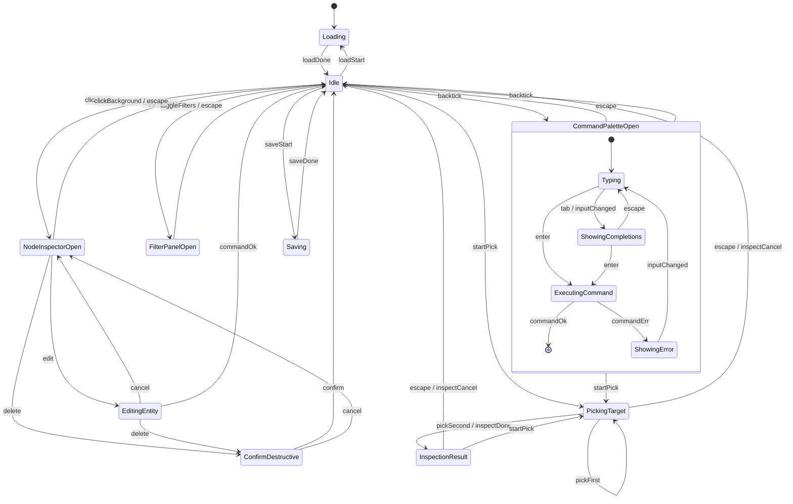

# App State Machine

Top-level finite state machine for the Tower Networking Inc PWA. Implemented in Vue with a single store (Pinia or `reactive()` composable) exposing the current state plus event dispatchers. Only one top-level state is active at a time; the graph view is always rendered underneath.

## States

- `Idle` — Graph visible, no modal/palette. Default state on load.
- `CommandPaletteOpen` — Pull-down command bar visible. Substates:
  - `Typing` — User editing input, no completion popup.
  - `ShowingCompletions` — Candidate list visible under input.
  - `ExecutingCommand` — Command handler running (async OK).
  - `ShowingError` — Last command failed; error line shown, input retained.
- `FilterPanelOpen` — Side/overlay filter panel visible.
- `NodeInspectorOpen` — Right-side inspector showing selected node details.
- `EditingEntity` — Form for create/modify of a node or edge. Invoked from command or inspector.
- `ConfirmDestructive` — Blocking modal for delete confirmation.
- `PickingTarget` — Two-point inspection pick mode; graph is live, palette is closed, a top banner prompts for endpoint 1 then endpoint 2. See [inspect.md](inspect.md).
- `InspectionResult` — Pinned result panel after `inspect route` / `inspect bottleneck`; graph is live underneath with path highlight applied.
- `Loading` — Reading project from localStorage or imported text.
- `Saving` — Writing project to localStorage or exporting.

## Events

- `backtick` — `` ` `` keydown, only when focus is not inside `<input>`/`<textarea>`/`contenteditable`.
- `escape` — Escape keydown.
- `clickNode(id)` — Pointer selects a node in the graph.
- `clickBackground` — Pointer on empty canvas area.
- `toggleFilters` — Filter toolbar button or command.
- `edit(id)` — Inspector "Edit" button or `mod` command with no args.
- `delete(id)` — Trash button or `rm` command.
- `confirm` / `cancel` — Destructive dialog buttons.
- `inputChanged` — Palette input updated.
- `tab` / `shiftTab` — Cycle completions.
- `enter` — Submit palette command.
- `commandOk` / `commandErr(msg)` — Handler result.
- `loadStart` / `loadDone` / `saveStart` / `saveDone` — I/O lifecycle.
- `startPick(tool)` — palette dispatches this for `inspect pick route` or `inspect pick bottleneck`.
- `pickFirst(id)` / `pickSecond(id)` — user clicks during pick mode.
- `inspectDone(result)` / `inspectCancel` — tool lifecycle.

## Diagram



## Transition rules

- `backtick` is swallowed when focus is inside any text-entry element. The palette itself listens for its own `backtick` to close (re-press toggles).
- `escape` always takes the most-nested modal state back one level: `ConfirmDestructive -> EditingEntity` (or prior), `EditingEntity -> NodeInspectorOpen`, `ShowingCompletions -> Typing`, `Typing -> Idle`.
- `clickBackground` clears selection and closes `NodeInspectorOpen` but does not close `EditingEntity` or `ConfirmDestructive`.
- `ExecutingCommand` is non-cancellable for simplicity; long operations show a spinner in the palette. All current commands are synchronous except `save`/`load`/`import`/`export`.
- `Saving` and `Loading` are top-level states to block conflicting edits; the palette is unavailable while active.
- Destructive ops (`rm node`, `rm link`) always route through `ConfirmDestructive` unless invoked with `--force`.
- `PickingTarget` is entered from either `Idle` or `CommandPaletteOpen` (the palette closes). `clickNode` is re-routed to `pickFirst`/`pickSecond`; `clickBackground` is ignored (click-to-deselect is suppressed during picking). `escape` cancels; the banner always shows which endpoint is next.
- After `pickSecond` the tool runs synchronously; on success the app transitions to `InspectionResult`. `InspectionResult` overlays a result panel but the graph beneath is fully interactive except that `clickNode` opens `NodeInspectorOpen` in addition to keeping the highlight visible (closing the inspector does not clear the highlight).
- `inspect clear` or `escape` in `InspectionResult` returns to `Idle` and clears `ui.pathHighlight`.

## State shape (Vue)

```ts
type AppState =
  | { kind: 'Loading' }
  | { kind: 'Idle' }
  | { kind: 'CommandPaletteOpen'; sub: PaletteSub; input: string; cursor: number; history: string[]; error?: string }
  | { kind: 'FilterPanelOpen' }
  | { kind: 'NodeInspectorOpen'; id: string }
  | { kind: 'EditingEntity'; target: { kind: 'node' | 'edge'; id?: string; type: string }; draft: Record<string, unknown> }
  | { kind: 'ConfirmDestructive'; op: 'rmNode' | 'rmEdge'; id: string; returnTo: AppState['kind'] }
  | { kind: 'PickingTarget'; tool: 'route' | 'bottleneck'; first?: string }
  | { kind: 'InspectionResult'; tool: 'route' | 'bottleneck'; result: InspectResult }
  | { kind: 'Saving' }
  ;

type PaletteSub = 'Typing' | 'ShowingCompletions' | 'ExecutingCommand' | 'ShowingError';
```

## Cross-cutting concerns

- Keyboard focus: entering `CommandPaletteOpen` captures focus on the palette input; on exit focus returns to the graph container.
- Undo/redo (`Ctrl+Z` / `Ctrl+Shift+Z`) works in `Idle`, `NodeInspectorOpen`, and `FilterPanelOpen`. Disabled while a modal is open.
- Unsaved-changes flag is separate from this FSM and surfaces in the title bar.

## Non-goals

- No multi-window, no multi-user collab states.
- No per-node FSM (node lifecycle is modeled by presence/absence in the graph model).
